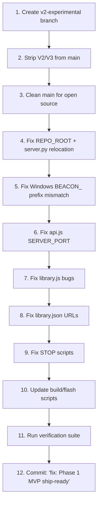

# Phase 1 Execution Plan — The Blackout Drive MVP Ship

> **Goal:** Transform the current codebase from a feature-rich dev prototype into a shippable, bug-free V1 USB product. Isolate all V2/V3 code, clean `main` for open source, squash every P0 blocker, and verify the payload.

---

## Codebase Audit Summary

I've read every file in the repository. Here's what I found vs. the production audit:

| Claim in Audit | Verified? | Notes |
|---|---|---|
| REPO_ROOT undefined in launchers | ✅ **CONFIRMED** | Line 135 of `START_MAC.command`: `python3 "$REPO_ROOT/scripts/server.py"` — `REPO_ROOT` is never set. Line 116 of `START_WINDOWS.bat`: same issue with `%REPO_ROOT%`. |
| SERVER_PORT undefined in api.js | ✅ **CONFIRMED** | Line 221 of `api.js`: `http://localhost:${SERVER_PORT}/api/open-file` — should be `${(cfg().network || cfg()).uiPort || 8080}` |
| `showManageSpace()` bug | ✅ **CONFIRMED** | Line 58 of `library.js`: `showManageSpace()` — function is actually `showManagePanel()` |
| `cancelPackDownload` broken | ✅ **CONFIRMED** | Line 1323: `startPackDownload(this)` passes the button element, not a pack object |
| Windows `BEACON_` prefix mismatch | ✅ **CONFIRMED** | `START_WINDOWS.bat` uses `%BEACON_MODEL_FILE%`, `%BEACON_OLLAMA_URL%`, `%BEACON_MODEL_NAME%`, etc. but `config.bat` defines `%BLACKOUT_*%` vars. The script won't find the model or Ollama. |
| Ham Radio tools built | ✅ **CONFIRMED** | `ham-radio.js` (408 lines) is a complete, working module — Phase 2 feature |
| TTS built in app.js | ✅ **CONFIRMED** | `toggleTTS()` function at line 250 uses Web Speech API — this is a Phase 1 acceptable feature (browser-native, zero added deps) |
| CDN references in config.json | ✅ **CONFIRMED** | `config.json` line 28: `cdn.blackoutdrive.com` — does not exist |
| Hesperian URLs broken | ✅ **CONFIRMED** | `library.json` lines 153, 165: point to store HTML pages |
| USDA canning URL broken | ✅ **CONFIRMED** | Line 122: points to `nchfp.uga.edu/publications/publications_usda.html` — an HTML page, not a PDF |

> [!IMPORTANT]
> **Additional critical bug not in the original audit:** `START_WINDOWS.bat` uses the old `BEACON_` variable prefix throughout (e.g., `%BEACON_MODEL_FILE%`, `%BEACON_OLLAMA_URL%`, `%BEACON_MODEL_NAME%`), but `config.bat` defines everything with the `BLACKOUT_` prefix. **Every single config variable lookup in the Windows launcher is broken.** This is a second launch-blocking bug on Windows, separate from REPO_ROOT.

---

## User Review Required

> [!WARNING]
> **Branching Decision:** The Ham Radio tools (`ham-radio.js`, 408 lines, fully working Morse encoder + frequency chart + quiz) and the `ham-radio` category in `library.json` are V2 features per your directive. I will move `ham-radio.js` to the `v2-experimental` branch and remove the `ham-radio` category from `library.json` on `main`. The TTS toggle (Web Speech API in `app.js`) uses **zero added binaries** — it's browser-native. I recommend keeping it in V1 as a "free" feature. Please confirm.

> [!WARNING]
> **Edition scaffolding in config.json:** `config.json` contains `editions.harvest` and `editions.chaplain` with `Modelfile.harvest` and `Modelfile.chaplain` references. These files don't exist. I will leave the scaffold in `config.json` (it's inert) but will NOT create dummy Modelfiles. Confirm this is acceptable.

> [!IMPORTANT]
> **CDN & Paid Pack removal:** The `catalog_extended.json` "Ham Radio & Emergency Comms Pack" ($4.99) points to `cdn.theblackoutdrive.com` which doesn't exist. I will remove this pack from the catalog on `main` and move it to `v2-experimental`. The 4 free packs (Bible Commentary, Extended Medical, Homestead, Philosophy) all point to valid Gutenberg URLs and will stay.

---

## Open Questions

1. **Hesperian PDF URLs:** The download links for "Where There Is No Doctor" and "Where There Is No Dentist" point to store pages, not direct PDFs. Hesperian's CC BY-SA PDFs are available via their [digital download portal](https://en.hesperian.org/hhg/New_Where_There_Is_No_Doctor), but they may require agreeing to terms. **Do you want me to:**
   - (a) Find direct PDF links and update `library.json`, or
   - (b) Remove these items from V1 and defer to V2 when you have your own CDN?

2. **USDA Canning Guide URL** also points to an HTML index page. Same question — find direct PDF or defer?

3. **Army FM PDF links** point to `bits.de` (German military archive) — fragile but currently working. Keep as-is for V1 or find alternate sources?

4. **STOP scripts:** `STOP_BEACON.command` and `STOP_BEACON.bat` don't kill the Python server. Should I fix these in V1, or is the launcher's trap/cleanup sufficient?

---

## Proposed Changes

### Step 1 — Isolate V2/V3 Code to `v2-experimental` Branch

#### Branch and commit strategy

1. Create `v2-experimental` from current `main` HEAD
2. On `main`, remove the V2/V3-only code (listed below)
3. Commit the removal as `chore: strip V2/V3 features for MVP ship`

#### Files to move/strip from `main`:

| File | Action | Rationale |
|---|---|---|
| [ham-radio.js](file:///Users/benjamin/github/The-Blackout-Drive/drive/ui/ham-radio.js) | **REMOVE** from `main` | 408-line V2 feature. Fully built, preserved on `v2-experimental` |
| [library.json](file:///Users/benjamin/github/The-Blackout-Drive/drive/content/library.json) `ham-radio` category (lines 325–339) | **REMOVE** category block | Ham Radio tools entry with `always_available: true` — no content on V1 |
| [catalog_extended.json](file:///Users/benjamin/github/The-Blackout-Drive/drive/content/catalog_extended.json) `ham-radio-premium` pack (lines 152–192) | **REMOVE** pack entry | Points to dead CDN, paid pack with no infrastructure |
| [index.html](file:///Users/benjamin/github/The-Blackout-Drive/drive/ui/index.html) `<script src="ham-radio.js">` (line 216) | **REMOVE** script tag | No longer needed without ham-radio.js |
| [library.js](file:///Users/benjamin/github/The-Blackout-Drive/drive/ui/library.js) ham-radio-tools handler (lines 581–593) | **Stub out** — change to show "Coming in V2" message instead of calling `renderHamRadioTools` | Graceful degradation if anyone has a stale catalog |

---

### Step 2 — Strip and Clean `main` for Open Source

#### [MODIFY] [config.json](file:///Users/benjamin/github/The-Blackout-Drive/drive/config.json)
- **Remove** `content.remoteCatalogUrl` and `content.remoteFilesBase` (CDN doesn't exist)
- Keep edition scaffold (inert, no harm)

#### [MODIFY] [README.md](file:///Users/benjamin/github/The-Blackout-Drive/README.md)
- Fix script names: `scripts/setup.sh` → `scripts/setup_drive.sh`, `scripts/test_drive.sh` → `scripts/dev_test.sh`
- Remove "Private Repo" badge — it's going open source
- Update "Phase 0" badge to "Phase 1"
- Clarify preloaded content (only KJV Bible + philosophy/law texts)
- Remove `drive/prompts/ ← 100+ survival prompts` from tree (directory is empty)
- Fix `knowledge/` → `content/` in the tree diagram

#### [MODIFY] [style.css](file:///Users/benjamin/github/The-Blackout-Drive/drive/ui/style.css)
- Consolidate the 4 accumulated patch blocks into the main design system sections
- Remove duplicate/conflicting `!important` declarations
- Remove dead ham-radio CSS classes (`.ham-tab-bar`, `.ham-phonetic-grid`, etc.)
- **No visual changes** — strictly structural cleanup

#### [MODIFY] [FIRST_RUN_README.txt](file:///Users/benjamin/github/The-Blackout-Drive/drive/FIRST_RUN_README.txt)
- Remove references to "A Book for Midwives", "Red Cross Family Disaster Plan" (don't exist)
- Remove Wikipedia ZIM items from the "What's on this drive" list (not preloaded)
- Replace `[your support URL here]` with `https://theblackoutdrive.com/support` or a GitHub Issues link

---

### Step 3 — Squash P0 Blockers

#### [MODIFY] [config.sh](file:///Users/benjamin/github/The-Blackout-Drive/drive/config.sh)
Add `BLACKOUT_DRIVE_ROOT` derived variable:
```bash
# ── Drive Root (auto-detected from config.sh location) ───
# This is the drive/ directory itself — where config.sh lives.
BLACKOUT_DRIVE_ROOT="$(cd "$(dirname "${BASH_SOURCE[0]}")" && pwd)"
```

#### [MODIFY] [config.bat](file:///Users/benjamin/github/The-Blackout-Drive/drive/config.bat)
Add drive root detection:
```batch
:: ── Drive Root (auto-detected from config.bat location) ───
set "BLACKOUT_DRIVE_ROOT=%~dp0"
```

#### [MODIFY] [START_MAC.command](file:///Users/benjamin/github/The-Blackout-Drive/drive/START_MAC.command)
- Line 135: Replace `$REPO_ROOT/scripts/server.py` with correct path derivation. Since `server.py` lives at `../scripts/server.py` relative to the drive, and `SCRIPT_DIR` already points to `drive/`, use:
  ```bash
  python3 "$SCRIPT_DIR/../scripts/server.py" "$BLACKOUT_UI_PORT" "$SCRIPT_DIR" &>/dev/null &
  ```
  However, on a flashed USB there is no `scripts/` folder — only `drive/` contents are rsynced. **This means `server.py` must be copied into the drive itself during flash.** I will:
  1. Add a `drive/scripts/` directory containing `server.py` (or symlink)
  2. Update `flash_drive.sh` to include `scripts/server.py` in the rsync payload
  3. Update the launcher to reference the co-located server

  **Alternative (simpler):** Copy `server.py` into `drive/` directly during the build step, and reference `$SCRIPT_DIR/server.py` in the launcher. This is cleaner — the USB drive is self-contained.

> [!IMPORTANT]
> **This is why the REPO_ROOT bug exists.** On a flashed USB, the `scripts/` directory doesn't exist — only `drive/` contents are copied. The server must live inside `drive/` or be copied there during flash. I'll handle this by having `setup_drive.sh` copy `server.py` into `drive/` and updating both launchers to reference `$SCRIPT_DIR/server.py`.

#### [MODIFY] [START_WINDOWS.bat](file:///Users/benjamin/github/The-Blackout-Drive/drive/START_WINDOWS.bat)
- **Fix variable prefix mismatch:** Replace ALL `%BEACON_*%` references with `%BLACKOUT_*%`:
  - `%BEACON_MODEL_FILE%` → `%BLACKOUT_MODEL_FILE%`
  - `%BEACON_OLLAMA_URL%` → `%BLACKOUT_OLLAMA_URL%`
  - `%BEACON_MODEL_NAME%` → `%BLACKOUT_MODEL_NAME%`
  - `%BEACON_MODELFILE%` → `%BLACKOUT_MODELFILE%`
  - `%BEACON_OLLAMA_HOST_ADDR%` → `%BLACKOUT_OLLAMA_HOST_ADDR%`
  - `%BEACON_OLLAMA_ORIGINS%` → `%BLACKOUT_OLLAMA_ORIGINS%`
  - `%BEACON_UI_PORT%` → `%BLACKOUT_UI_PORT%`
  - `%BEACON_UI_URL%` → `%BLACKOUT_UI_URL%`
- Fix `%REPO_ROOT%` → `%SCRIPT_DIR%server.py` (same server.py relocation fix)
- Fix model load order: check `ollama list` BEFORE `ollama run`
- Fix `taskkill /f /im python.exe` → use PID tracking via temp file

#### [MODIFY] [api.js](file:///Users/benjamin/github/The-Blackout-Drive/drive/ui/api.js)
- Line 221: Replace `SERVER_PORT` with `(cfg().network || cfg()).uiPort || 8080`

#### [MODIFY] [library.js](file:///Users/benjamin/github/The-Blackout-Drive/drive/ui/library.js)
- Line 58: `showManageSpace()` → `showManagePanel()`
- Line 1323: `startPackDownload(this)` → reconstruct pack object from DOM or store pack reference in a closure

#### [MODIFY] [library.json](file:///Users/benjamin/github/The-Blackout-Drive/drive/content/library.json)
- Fix or remove Hesperian medical PDF URLs (pending your answer to Open Question #1)
- Fix USDA canning URL (pending your answer to Open Question #2)

#### [MODIFY] [STOP_BEACON.command](file:///Users/benjamin/github/The-Blackout-Drive/drive/STOP_BEACON.command)
- Add `pkill -f "server.py"` to also kill the Python server process

#### [MODIFY] [STOP_BEACON.bat](file:///Users/benjamin/github/The-Blackout-Drive/drive/STOP_BEACON.bat)
- Kill Python server by PID or window title, not `python.exe` globally

---

### Step 4 — Finalize the Payload

#### [MODIFY] [setup_drive.sh](file:///Users/benjamin/github/The-Blackout-Drive/scripts/setup_drive.sh)
- Add step to copy `scripts/server.py` → `drive/server.py` so the USB is self-contained
- Update integrity checks to verify `drive/server.py` exists

#### [MODIFY] [flash_drive.sh](file:///Users/benjamin/github/The-Blackout-Drive/scripts/flash_drive.sh)
- Verify `server.py` is in `drive/` before flashing
- Switch rsync from `-v` to `--info=progress2` for cleaner output

#### [MODIFY] [dev_test.sh](file:///Users/benjamin/github/The-Blackout-Drive/scripts/dev_test.sh)
- Fix `BEACON_*` → `BLACKOUT_*` variable references
- Use `scripts/server.py` instead of `python3 -m http.server` so API endpoints are actually tested

#### Verify download scripts
- Confirm `download_runtime.sh` produces the correct directory structure: `drive/runtime/ollama-mac-arm/ollama`, etc.
- Confirm `download_models.sh` places the GGUF into `drive/models/`
- These scripts look correct but have **never been run** — I will verify by reading them in full (already done: they look structurally sound)

---

## Verification Plan

### Automated Tests
1. **Syntax check all scripts:**
   ```bash
   bash -n drive/START_MAC.command
   bash -n drive/config.sh
   bash -n scripts/setup_drive.sh
   ```
2. **Grep for stale references:**
   ```bash
   grep -rn "REPO_ROOT\|BEACON_\|cdn\.theblackoutdrive\|cdn\.blackoutdrive\|SERVER_PORT\|showManageSpace\|doomsday" drive/ scripts/
   ```
3. **Verify no broken script names in docs:**
   ```bash
   grep -rn "setup\.sh\|test_drive\.sh\|flash_usb\.sh\|build_image\.sh" docs/ README.md
   ```

### Manual Verification
1. **Start the server from the repo** and confirm all API endpoints respond:
   - `GET /api/status`
   - `GET /api/manifest`
   - `GET /api/search?q=test`
   - `GET /api/library-context`
2. **Open the UI in browser** and verify:
   - BEACON connects (status goes green)
   - Library opens, categories load
   - KJV Bible reader works
   - GET MORE panel shows only free packs (no Ham Radio paid pack)
   - Manage Space panel loads
3. **Test `openFile()` in api.js** — confirm it uses the correct port
4. **Full launcher test** (after payload download): double-click `START_MAC.command` and verify the complete boot sequence

---

## Execution Order



> [!CAUTION]
> I will NOT run `download_runtime.sh` or `download_models.sh` during this session — those download ~2GB+ of binaries. I will verify the scripts are correct by reading them. You should run them manually when you're ready to flash a physical drive.
